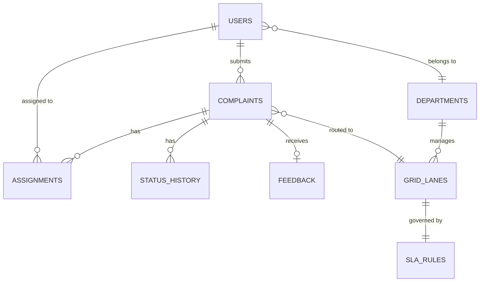

# 🏗️ GrievanceGrid — Backend Architecture (Demo Build)

> **Scope:** Demo / Showcase — not a full production application  
> **Stack:** FastAPI (Python) · SQLite (via SQLAlchemy) · Firebase Auth  
> **Goal:** Functional demo with realistic seeded data to showcase the platform's capabilities

---

## 1. Demo Simplifications

| Production Feature         | Demo Approach                                                                    |
| -------------------------- | -------------------------------------------------------------------------------- |
| PostgreSQL + migrations    | **SQLite** — zero setup, single file DB                                          |
| Redis + Celery workers     | **In-process background tasks** (FastAPI BackgroundTasks)                        |
| Twilio SMS                 | **Console logging** (mock SMS)                                                   |
| SendGrid Email             | **Console logging** (mock email)                                                 |
| Firebase Cloud Messaging   | **Console logging** (mock push)                                                  |
| Firebase Auth verification | **Simplified auth** — Firebase token check with fallback mock mode for local dev |
| 10k concurrent users       | **Single worker** — demo scale only                                              |
| Alembic migrations         | **Auto-create tables** on startup (`Base.metadata.create_all`)                   |

---

## 2. Project Structure

```
backend/
├── app/
│   ├── __init__.py
│   ├── main.py                  # FastAPI app, startup events, CORS
│   ├── config.py                # Settings (env vars via pydantic-settings)
│   │
│   ├── core/
│   │   ├── security.py          # Firebase token verify + mock auth mode
│   │   ├── dependencies.py      # get_current_user, require_role
│   │   └── exceptions.py        # Custom HTTP exceptions
│   │
│   ├── models/                  # SQLAlchemy ORM models
│   │   ├── base.py              # Declarative Base
│   │   ├── user.py
│   │   ├── complaint.py
│   │   ├── department.py
│   │   ├── assignment.py
│   │   ├── status_history.py
│   │   ├── sla_rule.py
│   │   ├── feedback.py
│   │   └── grid_lane.py
│   │
│   ├── schemas/                 # Pydantic request/response models
│   │   ├── user.py
│   │   ├── complaint.py
│   │   ├── assignment.py
│   │   ├── analytics.py
│   │   └── common.py            # Pagination, enums
│   │
│   ├── api/                     # Route handlers
│   │   ├── auth.py
│   │   ├── complaints.py
│   │   ├── officer.py
│   │   ├── admin.py
│   │   ├── routing.py
│   │   ├── sla.py
│   │   ├── analytics.py
│   │   ├── search.py
│   │   └── health.py
│   │
│   ├── services/                # Business logic
│   │   ├── complaint_service.py
│   │   ├── routing_engine.py    # Keyword categorization + assignment
│   │   ├── sla_engine.py        # SLA check logic
│   │   └── analytics_service.py
│   │
│   └── db/
│       ├── session.py           # SQLite session factory
│       └── seed.py              # Demo data seeding script
│
├── tests/
│   ├── test_complaints.py
│   ├── test_routing.py
│   └── test_analytics.py
│
├── grievancegrid.db             # SQLite file (auto-created)
├── requirements.txt
├── .env.example
└── run.py                       # Entry point: uvicorn runner
```

---

## 3. Database Schema (SQLite)

### Entity-Relationship Diagram



### Table Definitions

#### `users`

| Column          | Type          | Notes                                   |
| --------------- | ------------- | --------------------------------------- |
| `id`            | `TEXT (UUID)` | PK                                      |
| `firebase_uid`  | `TEXT`        | UNIQUE — Firebase Auth UID (or mock ID) |
| `full_name`     | `TEXT`        |                                         |
| `email`         | `TEXT`        | UNIQUE, nullable                        |
| `phone`         | `TEXT`        |                                         |
| `role`          | `TEXT`        | `citizen` / `officer` / `admin`         |
| `department_id` | `TEXT`        | FK → departments.id (officers only)     |
| `is_active`     | `BOOLEAN`     | DEFAULT true                            |
| `avatar_url`    | `TEXT`        | Profile picture URL                     |
| `created_at`    | `DATETIME`    |                                         |

#### `departments`

| Column            | Type          | Notes                       |
| ----------------- | ------------- | --------------------------- |
| `id`              | `TEXT (UUID)` | PK                          |
| `name`            | `TEXT`        | UNIQUE — e.g. "Electricity" |
| `description`     | `TEXT`        |                             |
| `head_officer_id` | `TEXT`        | FK → users.id               |

#### `grid_lanes`

| Column             | Type          | Notes                                  |
| ------------------ | ------------- | -------------------------------------- |
| `id`               | `TEXT (UUID)` | PK                                     |
| `name`             | `TEXT`        | e.g. `ELECTRICITY_LIGHTING`            |
| `category`         | `TEXT`        | e.g. "Street Light"                    |
| `department_id`    | `TEXT`        | FK → departments.id                    |
| `sla_rule_id`      | `TEXT`        | FK → sla_rules.id                      |
| `keywords`         | `TEXT`        | Comma-separated keywords for routing   |
| `default_priority` | `TEXT`        | `low` / `medium` / `high` / `critical` |

#### `sla_rules`

| Column               | Type          | Notes                 |
| -------------------- | ------------- | --------------------- |
| `id`                 | `TEXT (UUID)` | PK                    |
| `name`               | `TEXT`        | e.g. "Critical - 24h" |
| `resolution_hours`   | `INTEGER`     | SLA deadline          |
| `escalation_1_hours` | `INTEGER`     | 1st escalation        |
| `escalation_2_hours` | `INTEGER`     | 2nd escalation        |

#### `complaints`

| Column         | Type          | Notes                                                         |
| -------------- | ------------- | ------------------------------------------------------------- |
| `id`           | `TEXT (UUID)` | PK                                                            |
| `grid_id`      | `TEXT`        | UNIQUE — Human ID: `GG-20260302-A1B2`                         |
| `citizen_id`   | `TEXT`        | FK → users.id                                                 |
| `category`     | `TEXT`        |                                                               |
| `description`  | `TEXT`        |                                                               |
| `latitude`     | `REAL`        |                                                               |
| `longitude`    | `REAL`        |                                                               |
| `address`      | `TEXT`        |                                                               |
| `media_urls`   | `TEXT`        | JSON array of URLs                                            |
| `status`       | `TEXT`        | `new`/`assigned`/`in_progress`/`resolved`/`rejected`/`closed` |
| `priority`     | `TEXT`        | `low`/`medium`/`high`/`critical`                              |
| `grid_lane_id` | `TEXT`        | FK → grid_lanes.id                                            |
| `grid_flag`    | `TEXT`        | `ESCALATED`, `VIP`, etc.                                      |
| `sla_deadline` | `DATETIME`    |                                                               |
| `resolved_at`  | `DATETIME`    |                                                               |
| `created_at`   | `DATETIME`    |                                                               |
| `updated_at`   | `DATETIME`    |                                                               |

#### `assignments`

| Column                  | Type          | Notes                       |
| ----------------------- | ------------- | --------------------------- |
| `id`                    | `TEXT (UUID)` | PK                          |
| `complaint_id`          | `TEXT`        | FK → complaints.id          |
| `officer_id`            | `TEXT`        | FK → users.id               |
| `assigned_by`           | `TEXT`        | FK → users.id (NULL = auto) |
| `is_active`             | `BOOLEAN`     |                             |
| `notes`                 | `TEXT`        |                             |
| `resolution_proof_urls` | `TEXT`        | JSON array                  |
| `assigned_at`           | `DATETIME`    |                             |
| `completed_at`          | `DATETIME`    |                             |

#### `status_history`

| Column         | Type          | Notes                         |
| -------------- | ------------- | ----------------------------- |
| `id`           | `TEXT (UUID)` | PK                            |
| `complaint_id` | `TEXT`        | FK → complaints.id            |
| `old_status`   | `TEXT`        |                               |
| `new_status`   | `TEXT`        |                               |
| `changed_by`   | `TEXT`        | FK → users.id (NULL = system) |
| `note`         | `TEXT`        |                               |
| `created_at`   | `DATETIME`    |                               |

#### `feedback`

| Column         | Type          | Notes                       |
| -------------- | ------------- | --------------------------- |
| `id`           | `TEXT (UUID)` | PK                          |
| `complaint_id` | `TEXT`        | FK → complaints.id (UNIQUE) |
| `citizen_id`   | `TEXT`        | FK → users.id               |
| `rating`       | `INTEGER`     | 1–5                         |
| `comment`      | `TEXT`        |                             |
| `created_at`   | `DATETIME`    |                             |

---

## 4. API Endpoints

All endpoints prefixed with `/api/v1`. For the demo, auth can run in **mock mode** (accept any token) for easy testing.

### Auth

| Method | Endpoint                  | Description                                           |
| ------ | ------------------------- | ----------------------------------------------------- |
| `POST` | `/auth/register`          | Register/sync user from Firebase token                |
| `POST` | `/auth/verify-token`      | Verify token, return user + role                      |
| `GET`  | `/auth/demo-login/{role}` | **Demo only:** instant login as citizen/officer/admin |

### Complaints

| Method | Endpoint                    | Role          | Description                              |
| ------ | --------------------------- | ------------- | ---------------------------------------- |
| `POST` | `/complaints`               | Citizen       | Create complaint (auto-triggers routing) |
| `GET`  | `/complaints/me`            | Citizen       | My complaints (paginated)                |
| `GET`  | `/complaints/{id}`          | Any           | Complaint detail                         |
| `GET`  | `/complaints`               | Officer/Admin | All complaints (filters, sort, paginate) |
| `PUT`  | `/complaints/{id}/status`   | Officer/Admin | Update status                            |
| `GET`  | `/complaints/{id}/timeline` | Any           | Status history timeline                  |

### Officer

| Method | Endpoint                         | Description             |
| ------ | -------------------------------- | ----------------------- |
| `GET`  | `/officer/queue`                 | My assigned complaints  |
| `POST` | `/officer/complaints/{id}/notes` | Add internal note       |
| `POST` | `/officer/complaints/{id}/proof` | Upload resolution proof |

### Routing

| Method | Endpoint                    | Description                                 |
| ------ | --------------------------- | ------------------------------------------- |
| `POST` | `/routing/auto-assign/{id}` | Trigger auto-assignment                     |
| `PUT`  | `/routing/reassign/{id}`    | Manual reassign                             |
| `GET`  | `/routing/suggestions/{id}` | Suggested officers (for Smart Assign modal) |

### SLA

| Method | Endpoint          | Description                     |
| ------ | ----------------- | ------------------------------- |
| `GET`  | `/sla/overdue`    | List overdue complaints         |
| `GET`  | `/sla/rules`      | List SLA rules                  |
| `GET`  | `/sla/compliance` | Compliance stats per department |

### Analytics (Dashboard)

| Method | Endpoint                            | Description                                       |
| ------ | ----------------------------------- | ------------------------------------------------- |
| `GET`  | `/analytics/kpi`                    | KPI cards (total, resolution %, avg time, agents) |
| `GET`  | `/analytics/by-category`            | Donut chart data                                  |
| `GET`  | `/analytics/trend`                  | Bar chart: daily complaint counts                 |
| `GET`  | `/analytics/department-performance` | Per-department stats                              |
| `GET`  | `/analytics/geo`                    | Complaint geo-coordinates for heatmap             |

### Search & Misc

| Method | Endpoint        | Description                        |
| ------ | --------------- | ---------------------------------- |
| `GET`  | `/search?q=...` | Omni-search (Grid ID, name, phone) |
| `GET`  | `/departments`  | List departments                   |
| `GET`  | `/health`       | Health check                       |

---

## 5. Core Logic (Simplified for Demo)

### 5.1 Routing Engine

```python
# Simplified keyword matching for demo

ROUTING_RULES = {
    "street light|electricity|power|transformer": {
        "grid_lane": "ELECTRICITY_LIGHTING",
        "department": "Electricity",
        "priority": "medium",
        "sla_hours": 48
    },
    "water|pipeline|tap|supply": {
        "grid_lane": "WATER_SUPPLY",
        "department": "Water Supply",
        "priority": "high",
        "sla_hours": 24
    },
    "garbage|sanitation|drain|sewage": {
        "grid_lane": "SANITATION_GENERAL",
        "department": "Sanitation",
        "priority": "medium",
        "sla_hours": 48
    },
    "road|pothole|footpath|bridge": {
        "grid_lane": "ROADS_INFRASTRUCTURE",
        "department": "Roads & Infrastructure",
        "priority": "high",
        "sla_hours": 72
    },
    # ... more rules
}

def auto_route(complaint):
    # Match keywords in description + category
    # Assign to least-loaded officer in matched department
    # Set SLA deadline
    # Return routing result
```

### 5.2 SLA Checker (Background Task)

```python
# Runs on interval via FastAPI's startup event + asyncio

async def check_sla_periodically():
    while True:
        overdue = get_overdue_complaints()
        for c in overdue:
            if not c.grid_flag:
                c.grid_flag = "ESCALATED"
                log_status_change(c, "ESCALATION_L1")
                print(f"[MOCK NOTIFICATION] SLA breach: {c.grid_id}")
        await asyncio.sleep(300)  # Check every 5 mins
```

### 5.3 Auth (Mock Mode for Demo)

```python
# In demo mode, use /auth/demo-login/{role} to get a session
# This returns a token for a pre-seeded user of that role
# No Firebase setup needed for demo presentations

@app.get("/api/v1/auth/demo-login/{role}")
async def demo_login(role: str):
    user = get_seeded_user_by_role(role)  # citizen, officer, or admin
    token = create_demo_token(user)
    return {"token": token, "user": user}
```

---

## 6. Demo Data Seeding

On first startup, the app auto-seeds the database with realistic demo data:

### Departments (5)

| Department             | Head                 |
| ---------------------- | -------------------- |
| Electricity            | Officer Rajesh Kumar |
| Water Supply           | Officer Priya Sharma |
| Sanitation             | Officer Amit Patel   |
| Roads & Infrastructure | Officer Sneha Gupta  |
| Public Safety          | Officer Vikram Singh |

### Users (15 total)

- **3 Admins:** Municipal Commissioner, Deputy Commissioner, Control Room Head
- **10 Officers:** 2 per department (1 senior, 1 field agent)
- **5 Citizens:** Demo citizen accounts with pre-submitted complaints

### Grid Lanes (10)

Mapped to departments with keyword rules and SLA configurations.

### Complaints (50 seeded)

- Mix of all statuses: `new` (10), `assigned` (10), `in_progress` (10), `resolved` (15), `rejected` (3), `closed` (2)
- Spread across all categories and departments
- Some marked `ESCALATED` for demo urgency
- Realistic geo-coordinates (clustered around a demo city area)
- Timestamps spanning the last 30 days for trend charts
- Some with feedback ratings

---

## 7. Dependencies

```txt
# requirements.txt

fastapi==0.115.*
uvicorn[standard]==0.34.*
pydantic==2.*
pydantic-settings==2.*
sqlalchemy==2.*
aiosqlite==0.20.*          # Async SQLite driver
firebase-admin==6.*        # Optional — only if using real Firebase auth
python-multipart==0.0.*    # File uploads
python-jose[cryptography]  # JWT for demo tokens
passlib                    # Password utils (demo mode)
httpx                      # Test client

# Dev
pytest==8.*
pytest-asyncio==0.24.*
black
ruff
```

---

## 8. Running the Demo

```bash
# 1. Setup
cd backend
python -m venv venv
source venv/bin/activate        # Windows: venv\Scripts\activate
pip install -r requirements.txt

# 2. Configure (optional — defaults work for demo)
cp .env.example .env

# 3. Run (auto-creates DB + seeds demo data on first run)
python run.py
# → Server running at http://localhost:8000
# → Swagger docs at http://localhost:8000/docs
# → Demo login at http://localhost:8000/api/v1/auth/demo-login/admin

# 4. Test
pytest
```

---

## 9. Key Design Decisions (Demo-Specific)

| Decision                      | Rationale                                                   |
| ----------------------------- | ----------------------------------------------------------- |
| **SQLite**                    | Zero setup — just run and demo. No DB server needed         |
| **Demo login endpoint**       | Skip Firebase setup entirely for presentations              |
| **Auto-seed on startup**      | Database always has realistic data ready to showcase        |
| **Mock notifications**        | Console logs instead of real SMS/email — no API keys needed |
| **In-process SLA checker**    | No Redis/Celery complexity — runs in the same process       |
| **Swagger UI at `/docs`**     | Built-in interactive API docs for live demo of endpoints    |
| **Single `requirements.txt`** | Simple install — no poetry/pipenv overhead                  |
